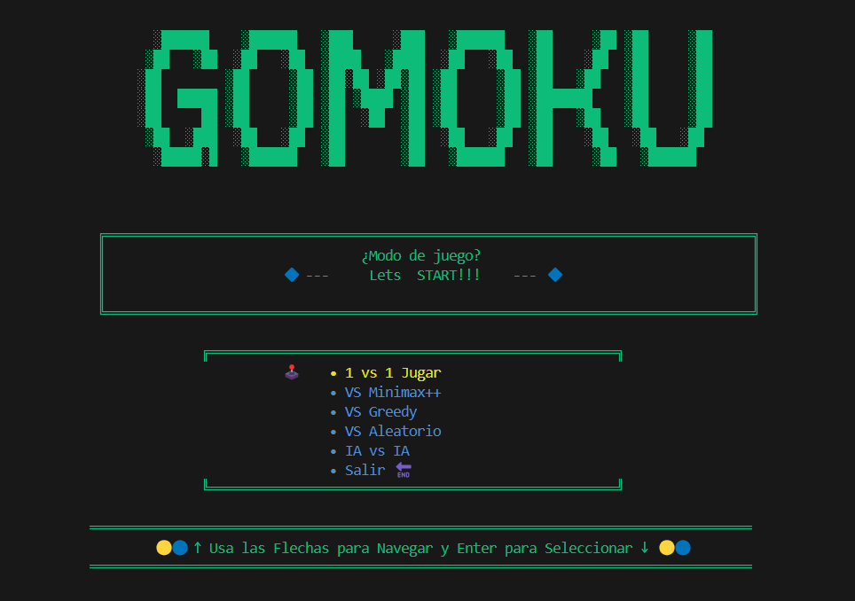

🕹️ Guía Rápida para Jugar
    Inicia el programa y elige el modo de juego desde el menú usando las flechas y Enter.
    En el tablero:
    Usa las flechas para mover el cursor.
    Pulsa Enter o Espacio para colocar tu ficha.
    Gana quien logre primero 5 fichas seguidas en cualquier dirección.
    Al terminar la partida, volverás automáticamente al menú para elegir otra opción o salir.

🎮 ¿Qué es Gomoku?
    Gomoku es un juego de tablero tradicional, también conocido como "Cinco en línea".
    Se juega en un tablero de 15x15 (en este código) y participan dos jugadores, que alternan turnos colocando sus fichas (🟡 y 🔵).

    Reglas Básicas
    El objetivo es ser el primero en alinear 5 fichas propias consecutivas (horizontal, vertical o diagonal).
    No se pueden colocar fichas sobre una casilla ocupada.
    El juego termina cuando un jugador logra 5 en línea o el tablero se llena (empate)

Puntos Sobresalientes
* Diseño modular: Cada parte del juego (menú, lógica, IA, tablero) está separada en archivos, facilitando la comprensión y       mantenimiento.
* IA Minimax: Implementa heurísticas avanzadas para evaluar amenazas y oportunidades, bloqueando jugadas ganadoras del oponente y  buscando la mejor estrategia.
* Modo IA vs IA: Permite observar cómo se enfrentan diferentes estrategias de IA.
  Interfaz amigable: Uso de colores y controles de teclado para una experiencia de usuario clara en consola.